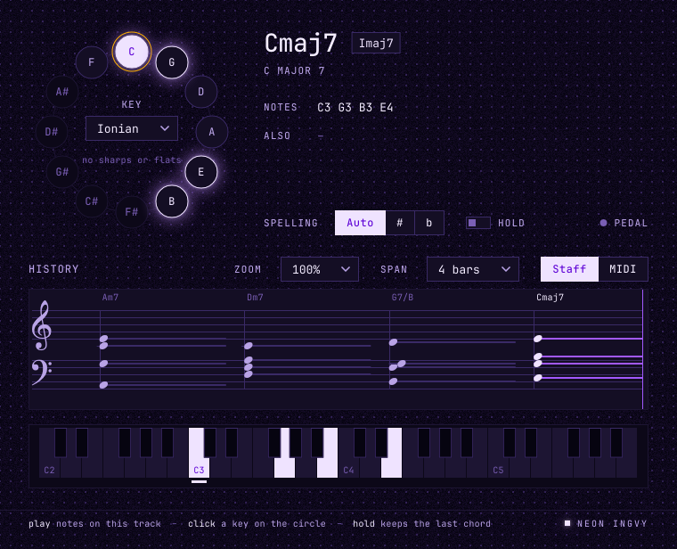

# NI Chord-Detector

Put it on a MIDI track and play. It tells you what you are playing: the chord
by name, its roman numeral in your key, the notes, and the other names the same
notes go by. A circle of fifths, a keyboard and a scrolling history light up as
you play.

It makes **no sound**. It is an instrument only because that is how Live hands
a plugin the notes of a MIDI lane.

## What it names

Everything sounding at once is read as one thing: every key held down, and every
key the sustain pedal is holding. All MIDI channels count as one.

| You play | It shows |
|---|---|
| one note | the note with its octave, `C4` |
| the same note in octaves | the note, `C in 3 octaves` |
| two notes | the interval, `C–E · major 3rd`; a fifth is a power chord, `C5` |
| three or more | the chord, `Am7`, read from the lowest note |
| three or more with no common name | the notes, `C Db D` |

**The bass decides.** The same four notes, C E G A, are C6 with C at the bottom
and A minor 7 with A at the bottom. A chord whose lowest note is not its root is
written with a slash: `C/E` is C major with E in the bass, its **first
inversion**. The other readings of the same notes are listed under **Also**.

**Sixteen notes** at most are read, the lowest sixteen. The keyboard and the
history still show every note.

## The key

Click a key on the **circle of fifths**, or step around it a fifth at a time
with the arrow keys, and pick a **mode** in its centre: Ionian (major), Dorian,
Phrygian, Lydian, Mixolydian, Aeolian (natural minor) or Locrian.

The key does two things:

- **Roman numerals.** Each chord gets its degree in the key: `ii7`, `V7`,
  `Imaj7`. A chord built on a note outside the key is marked with a flat or a
  sharp: B flat major in C major is `bVII`, F sharp half-diminished is `#ivø7`.
- **Spelling.** With **Spelling** on **Auto**, notes are named the way a score
  in the key writes them: `Bb` in C major, `E#` in F sharp major, `G#` in A minor.
  **#** and **b** name every black key one way instead.

On the circle, the seven notes of the key are tinted, the notes sounding are
lit, the chord's root is filled, and the key you chose wears an amber ring.

## Hold

A chord released key by key passes through every smaller chord on its way to
silence. With **Hold** on, the chord you played stays named while its keys come
up, and after the last one it stays on screen, dimmed and marked **HELD**,
until you play something new.

## The history

The last bars scroll from right to left, with now at the right edge, in your
song's bars.

- **Staff** shows them as notes on a grand staff with the key signature: a note
  head where each note began and a line for as long as it sounded. Chord names
  sit above the staff where each chord began. It does not write rhythm — no
  quarter notes, no rests — because naming a rhythm is a guess and this is a
  record.
- **MIDI** shows one line per note, numbered at each C, and a bar for each note.

**Span** sets how many bars it shows: 1, 2, 4 or 8. While the transport is
stopped the history keeps scrolling at the last tempo, so you can play to it.

## The window

**Zoom** makes it 75, 100, 125 or 150 percent of its size. The window keeps its
proportions and nothing in it moves.

## Parameters

| Name | Choices | Automatable |
|---|---|---|
| Key | C to B | yes |
| Mode | Ionian … Locrian | yes |
| Spelling | Auto, Sharps, Flats | yes |
| Hold | Off, On | yes |
| History | Staff, MIDI | no |
| Span | 1, 2, 4, 8 bars | no |
| Zoom | 75 %, 100 %, 125 %, 150 % | no |

All seven are saved with your set. The last three only change the window, so
Live is not offered them for automation.

## How it is built

The engine is Rust (`engines/chord-detector`): which notes sound, what they are
called and the history's clock. The names come from
[music-core](../../engines/shared/crates/music-core/README.md), the repository's
music theory library. The plugin around it is a JUCE 9 VST3 for macOS, Windows
and Linux, its window built from the native Ultraviolet kit. Nothing on the audio thread allocates, and a panic
(All Notes Off) clears everything at once.

See [NI Chord-Detector in Ableton Live](docs/live.md) for setting it up.
